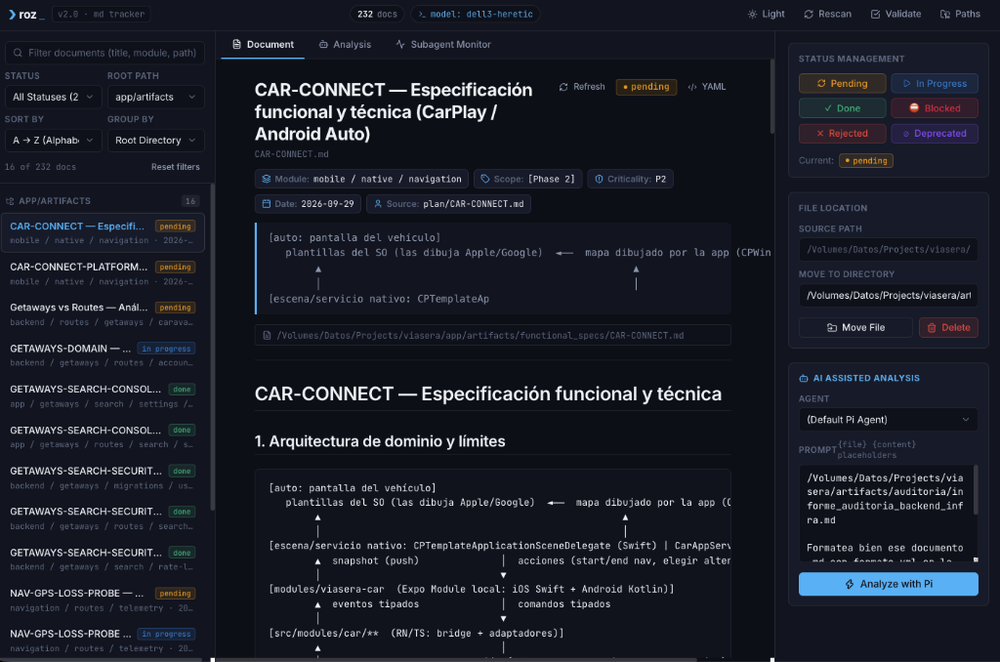
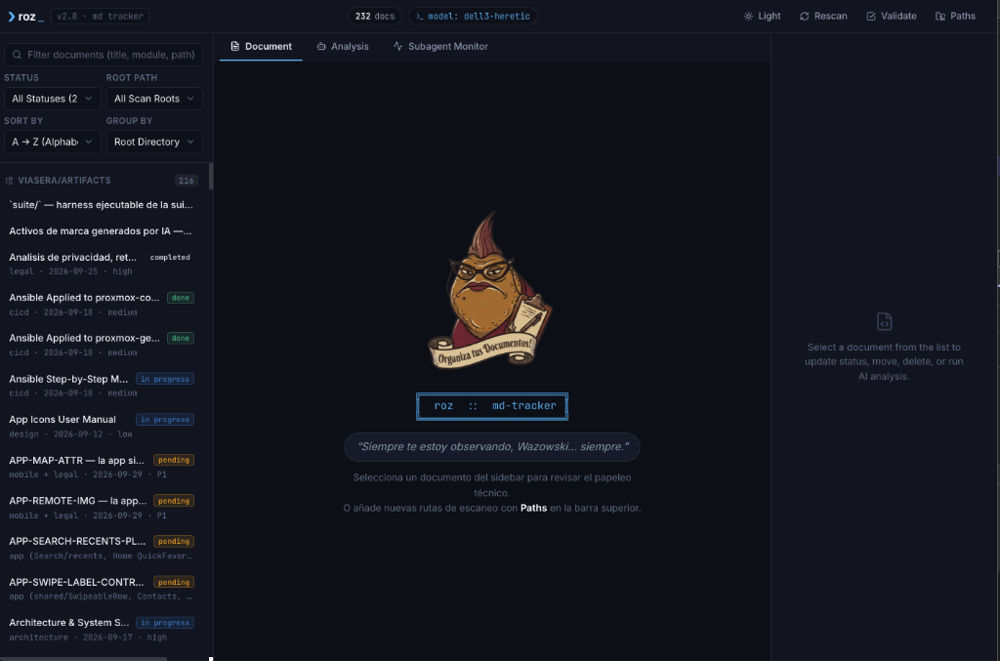
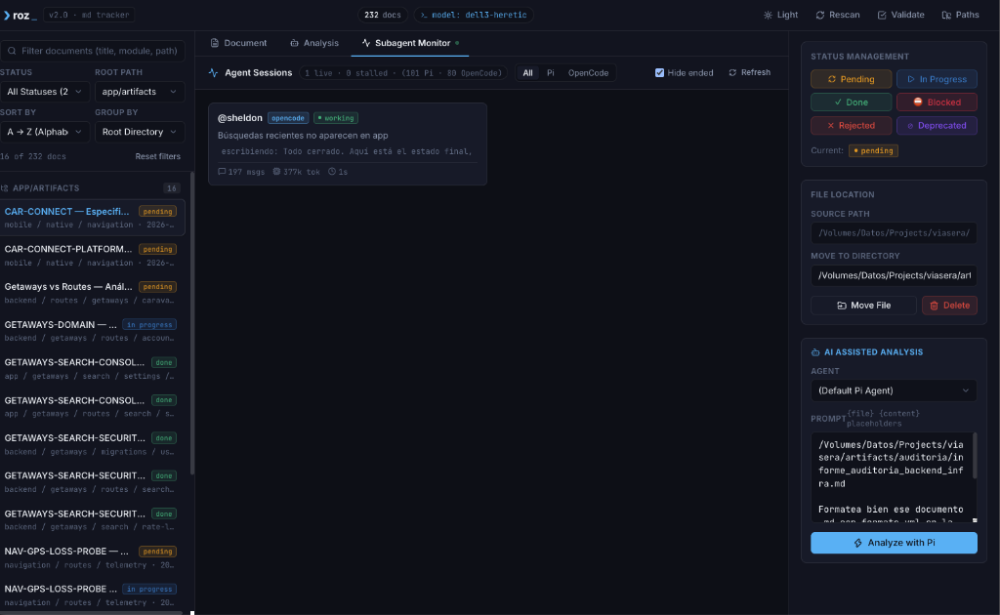

<p align="center">
  
</p>

<h1 align="center">Roz</h1>

<p align="center">
  <b>"I'm watching you, Wazowski... always watching."</b><br>
  <i>Gestión burocrática implacable de documentación técnica Markdown y torre de control para la vigilancia en tiempo real de agentes de inteligencia artificial.</i>
</p>

<p align="center">
  <a href="https://fastapi.tiangolo.com/"></a>
  <a href="https://react.dev/"></a>
  <a href="https://www.typescriptlang.org/"></a>
  <a href="https://bun.sh/"></a>
  <a href="https://vitejs.dev/"></a>
  <a href="LICENSE"></a>
</p>

---

## Overview

**Roz** es el centro de supervisión burocrático definitivo para ecosistemas de desarrollo asistido por agentes. Inspirada en la inflexible supervisora de *Monsters, Inc.*, Roz nace bajo una premisa innegociable: **ningún archivo queda sin clasificar y ningún agente trabaja en la sombra sin rendir cuentas**. En entornos modernos de ingeniería donde los agentes de IA generan planes, especificaciones, deuda técnica y auditorías a un ritmo vertiginoso, Roz impone orden, visibilidad y control estricto.

La plataforma combina un motor de escaneo inteligente multi-raíz que indexa, valida y estructura documentos `.md` (a través de metadatos YAML frontmatter y tablas de especificación) junto a una central de monitoreo de procesos para trabajadores en segundo plano (agentes y subagentes de ecosistemas como **Pi** y **OpenCode**). Desde la revisión de deuda técnica y cambios de ciclo de vida hasta la auditoría interactiva vía RPC y la supervisión de telemetría, Roz garantiza que el papeleo esté en regla y los agentes operen bajo supervisión total.

---

## What It Solves

* **Anarquía de Documentación y Especificaciones Huérfanas**: Evita que planes de arquitectura, auditorías y notas de deuda técnica queden dispersos u olvidados en árboles de directorios profundos.
* **Falta de Estandarización en Metadatos**: Extrae y valida automáticamente encabezados YAML frontmatter y esquemas tabulares (módulo, estado, prioridad, alcance, autor y fecha).
* **Agentes Desbocados y Tareas Ocultas**: Proporciona visibilidad en tiempo real de qué subagentes están ejecutándose, su consumo de tiempo, estado de actividad (`active`, `quiet`, `stalled`) y capacidad de aborto inmediato (`kill switch`).
* **Fricción en la Auditoría Interactiva**: Permite abrir sesiones interactivas de análisis con agentes vía WebSocket sin salir del navegador, respondiendo a preguntas interactivas y enviando preguntas de seguimiento (*follow-ups*).
* **Ciclo de Vida de Tareas Manual y Lento**: Facilita la transición de estados (`pending`, `active`, `done`, `rejected`, `deprecated`), el traslado organizado a carpetas de archivo y la eliminación segura de documentos obsoletos.

---

## Key Features

### Gestión y Clasificación de Documentos Markdown

<p align="center">
  
</p>

* **Escaneo Multi-Proyecto**: Configuración dinámica de múltiples rutas raíz locales simultáneas con persistencia en `localStorage`.
* **Extracción Inteligente de Metadatos**: Detección automática de variables frontmatter YAML y tablas de especificaciones técnicas (`Status`, `Priority`, `Module`, `Scope`, `Author`, `Date`).
* **Motor de Filtrado y Agrupación**:
  * Filtrado granular por estado (`active`, `pending`, `done`, `rejected`, `deprecated`, `no-status`) y por directorio raíz.
  * Agrupación flexible: por carpeta raíz, por jerarquía de subcarpetas, por módulo funcional o vista plana.
  * Ordenación por relevancia temporal, orden alfabético o severidad de estado.
* **Visor Markdown de Alto Rendimiento**: Renderizado GFM (GitHub Flavored Markdown) con resaltado de sintaxis tipado (`highlight.js`) y tabla de metadatos visuales.
* **Acciones de Ciclo de Vida**: Transición de estado con un solo clic, reubicación a directorios de cierre (ej. `done/`) y eliminación protegida por diálogo de confirmación.

### Supervisión de Trabajadores y Agentes de IA

<p align="center">
  
</p>

* **Torre de Control Multi-Proveedor**: Soporte nativo para providers de agentes (**Pi** y **OpenCode**).
* **Monitoreo de Subagentes en Vivo**:
  * Detección automática de procesos huérfanos, subagentes activos y sesiones de trabajo.
  * Clasificación visual de salud de la sesión (`active`, `quiet`, `stalled`).
  * Telemetría de inactividad (*idle seconds*) y tamaño de registros.
* **Inspección de Logs en Streaming**: Visualización en directo de trazas de ejecución (`tail -f`) para auditar las decisiones del agente.
* **Kill Switch Seguro**: Envío de señales de terminación controlada (`SIGTERM`) para abortar tareas que hayan entrado en bucle o consuman recursos innecesarios.

### Sesiones de Análisis Interactivo (Pilot RPC)
* **Conexión WebSocket Bidireccional**: Streaming de razonamiento interno (*thinking stream*) y respuesta en lenguaje natural.
* **Diálogos Interactivos en UI**: Renderizado nativo de peticiones de aclaración del agente (`ask_user_question`, confirmaciones de confirmación) mediante botones y formularios.
* **Continuidad de Conversación**: Barra de mensajes interactiva para guiar al modelo mientras la sesión permanece abierta.

---

## Document Format Specification

Para que Roz pueda indexar, clasificar, validar y gestionar automáticamente el ciclo de vida de los documentos Markdown (`.md`), se requiere el uso de metadatos estandarizados al inicio del archivo.

### Estándar Canónico: YAML Frontmatter

Todo documento técnico (`artifacts/`, `plan/`, especificaciones, auditorías o notas de deuda) debe comenzar con un bloque de frontmatter YAML delimitado por `---`:

```yaml
---
title: <TAG — Título descriptivo>
module: <módulo(s) afectados, ej: mobile / routes / backend / infra / backoffice>
author: <sheldon | homero | edna | tio-bob | gorgory | contador | saul | profesor | humano>
date: YYYY-MM-DD
status: Pending | In Progress | Done | Blocked | Rejected | Deprecated
priority: P0 | P1 | P2 | P3
scope: "[MVP]" | "[Phase N]" | "[Backlog]"
source: <ruta al plan/especificación de origen, ej: plan/TAG.md o tarea>
---
```

#### Diccionario de Campos y Valores Permitidos

| Campo | Tipo / Formato | Requerido | Valores Admitidos / Ejemplos |
| :--- | :--- | :---: | :--- |
| `title` | `String` | Sí | Identificador y título descriptivo (ej. `AUTH-SESSION — Refactor de tokens`) |
| `module` | `String` | Sí | Módulos afectados (ej. `mobile`, `routes`, `backend`, `infra`, `backoffice`) |
| `author` | `Enum / String` | Sí | `sheldon`, `homero`, `edna`, `tio-bob`, `gorgory`, `contador`, `saul`, `profesor`, `humano` |
| `date` | `YYYY-MM-DD` | Sí | Fecha de creación o última modificación (ej. `2026-09-30`) |
| `status` | `Enum` | Sí | `Pending`, `In Progress`, `Done`, `Blocked`, `Rejected`, `Deprecated` |
| `priority` | `Enum` | Sí | `P0` *(Crítico/Bloqueante)*, `P1` *(Alto)*, `P2` *(Medio)*, `P3` *(Bajo)* |
| `scope` | `String` | Opcional | Alcance del cambio (ej. `"[MVP]"`, `"[Phase 1]"`, `"[Phase 2]"`, `"[Backlog]"`) |
| `source` | `String` | Opcional | Origen del documento (ej. `plan/TAG.md`, `ticket #104`, `auditoría`) |

### Formato Alternativo: Tabla de Metadatos (GFM Header Table)

Roz también admite de forma retrocompatible la declaración de metadatos mediante una tabla GFM al comienzo del archivo:

```markdown
# CAR-CONNECT — Especificación funcional y técnica

| Field | Value |
| :--- | :--- |
| **Status** | Pending |
| **Priority** | P1 |
| **Module** | mobile / native |
| **Scope** | [Phase 2] |
| **Author** | sheldon |
| **Date** | 2026-09-29 |
```

> [!NOTE]
> Cuando se actualiza el estado o se realizan modificaciones desde la interfaz de Roz, el motor detecta automáticamente el formato existente en el archivo (YAML frontmatter o tabla GFM) y preserva su estructura original.

---

## Quick Start

### Requisitos Previos
* **Python 3.10+**
* **Bun 1.1+** o **Node.js 20+**
* **Navegador moderno** (Chrome, Firefox, Safari, Arc)

### Instalación y Puesta en Marcha

1. **Clonar el repositorio**:
   ```bash
   git clone https://github.com/AdelysAlberto/roz.git
   cd roz
   ```

2. **Configurar el entorno**:
   ```bash
   cp .env.example .env   # Ajustar rutas de proyectos, host o puerto si es necesario
   ```

3. **Iniciar Roz**:
   ```bash
   ./start.sh
   ```
   *El script configurará automáticamente el entorno virtual de Python (`.venv`), instalará dependencias del backend, compilará la SPA de React con Bun si no existe `dist/` y levantará el servidor en `http://127.0.0.1:8756`.*

4. **Detener el servicio**:
   ```bash
   ./stop.sh
   ```

---

## Usage Reference / Commands

### Modo Desarrollo Frontend (Vite HMR)

Para trabajar en la interfaz de usuario con recarga rápida en caliente:

```bash
# Terminal 1: Iniciar backend FastAPI
./start.sh

# Terminal 2: Iniciar servidor de desarrollo de React
cd frontend
bun dev
# → Interfaz accesible en http://localhost:5173 con proxy automático hacia el backend
```

### Configuración de Variables de Entorno (`.env`)

| Variable | Descripción | Valor por Defecto |
| :--- | :--- | :--- |
| `ROZ_HOST` | Dirección de enlace para el servidor HTTP | `127.0.0.1` |
| `ROZ_PORT` | Puerto de escucha de la aplicación | `8756` |
| `ROZ_PROJECT_ROOTS` | Rutas raíz por defecto separadas por comas | Directorio actual |
| `PI_BINARY` | Ruta al binario ejecutable de `pi` | `pi` |
| `PI_DEFAULT_MODEL` | Modelo por defecto para análisis RPC | Configuración local |

### Endpoints Principales del Backend

* `GET /api/documents?roots=...`: Devuelve la lista indexada de documentos con metadatos y frontmatter.
* `GET /api/document?path=...`: Obtiene el contenido Markdown íntegro de un archivo.
* `POST /api/document/status`: Actualiza el estado en el frontmatter del archivo.
* `POST /api/document/move`: Traslada un documento a un nuevo directorio de destino.
* `DELETE /api/document?path=...`: Elimina el documento tras confirmación.
* `GET /api/sessions`: Devuelve las sesiones y subagentes en ejecución detectados por los proveedores.
* `GET /api/sessions/log?path=...`: Devuelve las últimas líneas del registro de un agente.
* `POST /api/sessions/kill`: Envía señal de terminación al subagente seleccionado.
* `WS /ws/analyze`: Canal WebSocket para streaming de análisis y ejecución de herramientas interactivas.

---

## Repository Architecture

```text
roz/
├── .env.example              # Plantilla de configuración de entorno
├── start.sh                  # Orquestador de arranque (venv + build + uvicorn)
├── stop.sh                   # Detención limpia mediante PID (.roz.pid)
│
├── docs/                     # Recursos de documentación y capturas
│   └── screenshots/          # Vistas de la aplicación y flujos de trabajo
│
├── server/                   # Backend FastAPI
│   ├── app.py                # Router API REST, WebSocket y hosting de SPA estática
│   ├── mdstore.py            # Parser de frontmatter YAML, tablas GFM y operaciones de archivo
│   ├── monitor.py            # Orquestador de sesiones de trabajo y subagentes
│   ├── pilot.py              # Puente interactivo RPC bidireccional con pi
│   └── providers/            # Adaptadores de agentes
│       ├── base.py           # Interfaz base de proveedor de ejecución
│       ├── pi_provider.py    # Integración con el ecosistema de agentes Pi
│       └── opencode_provider.py # Integración con sesiones y logs de OpenCode
│
└── frontend/                 # SPA React 19 + TypeScript + Bun + Vite
    ├── src/
    │   ├── components/
    │   │   ├── layout/       # Layout principal, cabecera de estado y pestañas
    │   │   └── ui/           # Sistema de diseño (Badge, Button, Input, Modal, Select)
    │   ├── features/
    │   │   ├── actions/      # Mutaciones de estado, archivado y eliminación
    │   │   ├── analysis/     # Visor de streaming WebSocket, thinking y follow-ups
    │   │   ├── documents/    # Visor Markdown, barra lateral, árboles y filtros
    │   │   ├── monitor/      # Tablero de supervisión de agentes, logs y kill switch
    │   │   ├── paths/        # Selector y gestor dinámico de rutas raíz
    │   │   └── validation/   # Validación de adherencia a esquemas de metadatos
    │   ├── services/         # Clientes de consulta tipados con TanStack Query
    │   ├── stores/           # Almacén de estado global con Zustand 5
    │   └── styles/           # Tokens CSS de tema claro/oscuro y estilos de lectura
    └── package.json          # Dependencias y scripts de compilación
```

---

## Author & Maintenance

Desarrollado y mantenido por **Adelys Alberto Belen**:

* **GitHub**: [@AdelysAlberto](https://github.com/AdelysAlberto)
* **Web**: [adalbeca.com](https://adalbeca.com)
* **Contacto**: `dev@adalbeca.com`

---

## License

Este proyecto está licenciado bajo los términos de la Licencia MIT. Consulta el archivo [LICENSE](file:///Volumes/Datos/Projects/services/roz/LICENSE) para más información.
